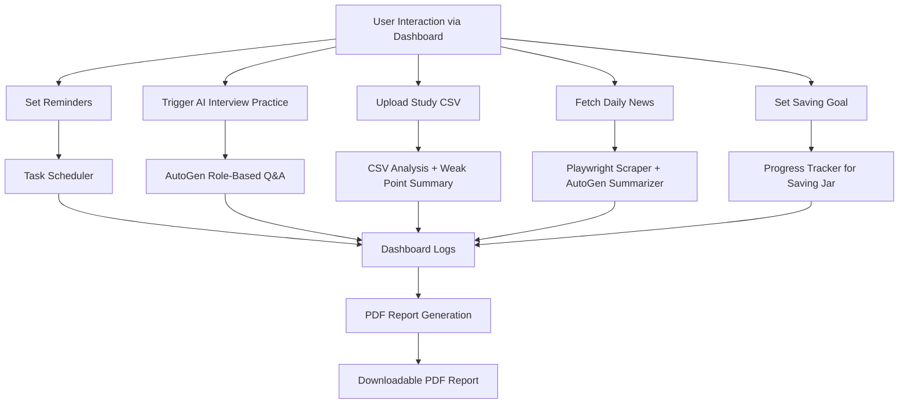

# Project Proposal: MINDY — Mindful Intelligent Navigator for Daily You

---

## 🌟 Project Name: **MINDY**

**Meaning:**  
MINDY represents a smart, compassionate, and proactive AI companion that supports users in cultivating daily habits, organizing life and learning goals, and staying motivated in their self-growth journey.

**Backronym:**  
**M**indful **I**ntelligent **N**avigator for **D**aily **Y**ou

---

## 🧠 Project Overview

**MINDY** is a personal self-improvement assistant that provides intelligent support in everyday tasks such as news analysis, reminders, interview practice, and academic tracking. It is built with privacy and productivity in mind, operating without requiring sensitive personal data.

The project aims to unify AI agents, automation tools, and a responsive dashboard into one cohesive experience that helps users grow steadily and mindfully every day.

---

## 🔧 Key Features

| Module                  | Description |
|-------------------------|-------------|
| **1. Daily Digest**     | Crawls selected news sources using Playwright, summarizes content with AutoGen, and generates actionable insights (e.g., "Read more about X topic" or "Consider practicing Y"). |
| **2. Smart Reminders**  | Allows users to set custom learning or self-care routines (e.g., reading, exercise, meditation). Alerts and logs are shown on the dashboard. |
| **3. Interview Coach**  | AI-powered mock interview system using AutoGen. Simulates HR/technical/stress interviewers and provides personalized feedback. |
| **4. Student Assistant**| Enables uploading study schedules or CSV files with progress, then analyzes weak spots or uncompleted topics. |
| **5. Saving Jar**       | Users can define savings goals and track their progress visually. Encourages small daily habits toward financial wellness. |
| **6. Dashboard View**   | Combines all modules in a centralized web interface built with Flask and Bootstrap. Charts and cards visualize progress and suggestions. |
| **7. PDF Report Export**| Generates a daily self-improvement report as a downloadable PDF summary. |

---

## ⚙️ Technologies Used

- **Frontend:** HTML, Bootstrap 5, JavaScript (optional charting via Chart.js / Plotly)
- **Backend:** Flask (Python)
- **AI Agent:** AutoGen (multi-role interaction)
- **Automation:** Playwright (browser crawling/login)
- **PDF Generation:** WeasyPrint / pdfkit
- **Task Scheduling:** APScheduler or Celery
- **Data Analysis:** Pandas + CSV Parsing

---

## 🚀 Development Phases

| Phase | Description |
|-------|-------------|
| **Phase 1: Core Setup** | Set up Flask framework and dashboard layout with placeholders |
| **Phase 2: Daily Digest Module** | Use Playwright to scrape headlines, summarize via AutoGen |
| **Phase 3: Smart Reminders** | Add task management UI and backend trigger logic |
| **Phase 4: Interview Assistant** | Implement AutoGen role-based simulation and result display |
| **Phase 5: Student Tracker** | Enable CSV upload + analysis + visualization |
| **Phase 6: Saving Jar Module** | Implement savings goal setting, visual progress tracker |
| **Phase 7: PDF Generator** | Export daily summary into a downloadable report |
| **Phase 8: UI Polish & Deployment** | Add responsive design, refine UX, and deploy locally or online |

---

## 📈 System Flow Diagram

